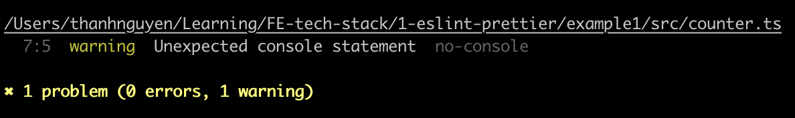

# LEARN TO USE ESLINT AND PRETTIER
This project is use to learn eslint and prettier in javascript projects

All steps will be listed here to rework later

### Step 1: Init the project by using vitejs to create
> yarn create vite example1 -- --template vanilla-ts

### Step 2: Add eslint
> yarn create @eslint/config
Select: 
- No framework
- Use typescript
- Run on browser

Add it will install eslint@9.x, globals, @eslint/js, typescript-eslint

A eslint.config.js file is added with below content:
```
import globals from "globals";
import pluginJs from "@eslint/js";
import tseslint from "typescript-eslint";


export default [
  {files: ["**/*.{js,mjs,cjs,ts}"]},
  {languageOptions: { globals: globals.browser }},
  pluginJs.configs.recommended,
  ...tseslint.configs.recommended,
];
```

### Step 3: Update eslint config file, run lint and check the result
- Add a rule for console.log to eslint.config.js
```
{
  rules: { 'no-console': 'warn' }
}
```
- Add a script to run lint to package.json `"lint": "eslint"`
- Add console.log to a ts file
- Run `yarn lint`
- Result


### Step 4: Add prettier to format code
- Install required package: prettier
- Add `prettier.config.js` and fill some simple rule:
```
export default {
  arrowParens: 'avoid',
  printWidth: 120,
  semi: false,
  singleQuote: true,
  trailingComma: 'none',
  tabWidth: 2,
}
```
- Add script to run prettier: `"format": "prettier --write \"**/*.{js,ts}\""`
- Run `yarn format` to format all js and ts files in the project

// eslint-config-prettier, eslint-plugin-prettier